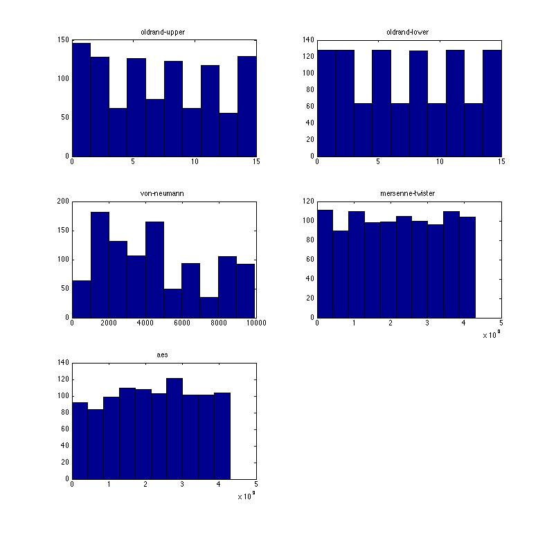
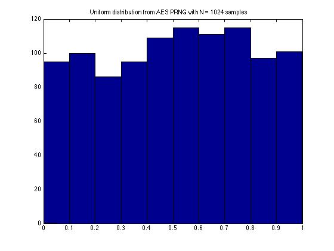
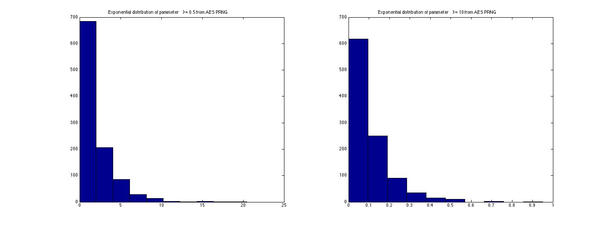
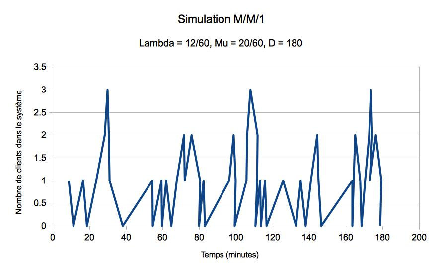
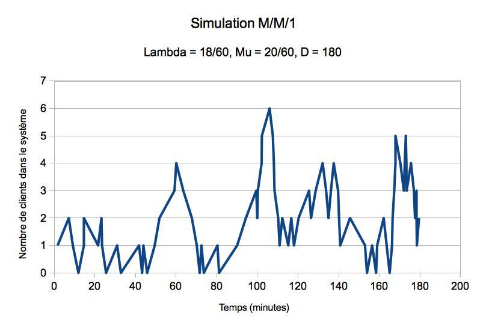
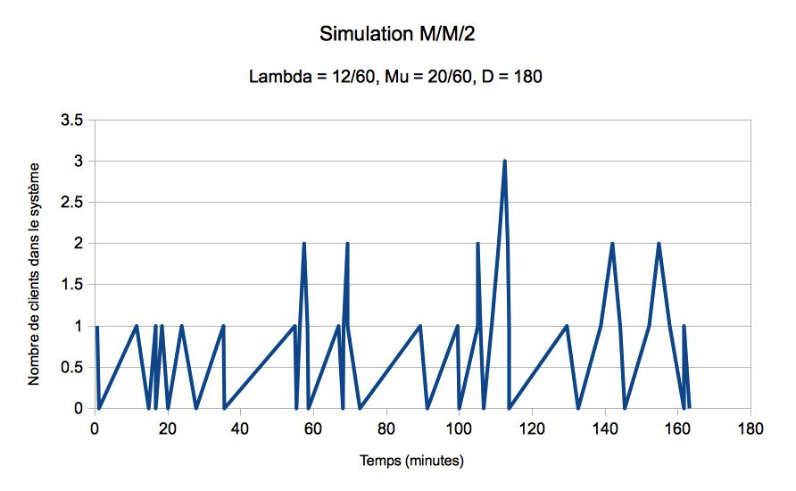

# Probabilités — TP génération de nombres aléatoires et probabilités
B3145 | Merlin NIMIER-DAVID & Robin RICARD

## Tests de générateurs pseudo-aléatoires

On se propose de tester les générateurs pseudo-aléatoires suivants :

- 4 bits de poids fort de l'ancien PRNG standard du c (`oldrand-upper`)
- 4 bits de poids faible de l'ancien PRNG standard du c (`oldrand-lower`)
- Générateur de Von-Neumann (`von-neumann`)
- Générateur Mersenne-Twister (`mersenne-twister`)
- Algorithme AES utilisé comme PRNG (`aes`)

On fera passer trois tests à chaque générateur. On remarque que tous les tests ne donnent pas toujours des résultats concordants. Il suffit qu'un générateur échoue à un test pour qu'il soit considéré comme peu performant.

### Test visuel

Le premier test réalisé est la visualisation de la répartition des nombres tirés. On effectue un tirage de `N = 1024` nombres pour chacun des PRNG et on trace les histogrammes correspondants.

On observe d'ores et déjà que `oldrand-upper`, `oldrand-lower` et `von-neumann` donnent des répartitions très peu régulières. Un PRNG possédant un tel biais ne peut être considéré comme performant.

### Test de fréquence monobit

On s'intéresse à la proportion de bits à 0 parmi les nombres générés. Pour ce faire, on tire `N = 1024` nombres que l'on concatène pour obtenir un unique flux de bits. D'après le théorème de la limite centrale, pour `N` grand, on observe une répartition selon la loi normale centrée réduite. On calcule alors la p-valeur correspondant à chaque observation : si `p-value < 0.01`, l'observation est très peu probable et on rejette le résultat. Le générateur peut être considéré comme mauvais.

| `oldrand-upper` | `oldrand-lower` | `von-neumann` | `mersenne-twister` | `aes`    |
| --------------- | --------------- | ------------- | ------------------ | -------- |
| 0.027125        | 1.000000        | 0.000000      | 0.650459           | 0.054621 |

On remarque que `oldrand-lower` génère des cycles de petite taille : toutes les valeurs sont répétées plusieurs fois. Avec 1024 tirages, il s'avère que l'on obtient une répartition parfaitement équilibrée. Cela explique les très bons résultats de `oldrand-lower` *pour ce test*. Au contraire, `von-neumann` échoue complètement au test de fréquence monobit.

### Test des runs

On s'intéresse à la longueur des suites successives de 0 et de 1. Comme précédemment, on génère `N = 1024` échantillons que l'on concatène pour les considérer comme un unique flux de bits. La p-valeur nous donne une mesure de la plausibilité de l'observation.

| `oldrand-upper` | `oldrand-lower` | `von-neumann` | `mersenne-twister` | `aes`    |
| --------------- | --------------- | ------------- | ------------------ | -------- |
| 0.084226        | 0.975070        | 0.000000      | 0.619458           | 0.749287 |

On observe à nouveau que `von-neumann` est peu performant.

### Conclusion

Ces seuls trois tests nous permettent de conclure que :

- `oldrand-upper`, `oldrand-lower` et `von-neumann` ne devraient pas être utilisés comme PRNG lorsque la qualité des nombres générés est critique.
- `mersenne-twister` et `aes` passent ces trois tests avec succès, ils semblent donc de meilleure qualité.

Par ailleurs, on constate la nécessité de croiser les résultats de plusieurs tests. En effet, se contenter d'un seul test ne peut donner une image représentative de la qualité des PRNG.

## Simulation de loi de probabilité exponentielle

### Simulation de loi uniforme

Afin de générer une loi exponentielle, on commence par générer une loi uniforme. En se basant sur les résultats précédents, on choisit le PRNG `aes` pour générer nos échantillons. Il suffit de les mettre à l'échelle pour obtenir une loi uniforme sur `[0,1]`.

On visualise la répartition des échantillons pour un tirage de `N = 1024` nombres.

### Simulation de loi exponentielle

À partir d'une loi exponentielle, on génère une loi de probabilité exponentielle de paramètre `lambda` en appliquant à l'échantillon :

	exponential_sample = - ln(1 - uniform_sample) / lambda

On obtient la répartition suivante :

## Application aux files d'attentes

### File M/M/1

Désormais dotés d'un générateur de loi de probabilité exponentielle, on peut simuler une file d'attente M/M/1 :

- Les arrivées de clients suivent une loi exponentielle de paramètre `lambda`
- Le temps de traitement d'un client suit une loi exponentielle de paramètre `mu`
- Un unique serveur sert tous les clients
- La simulation dure `d` minutes

Pour les paramètres `lambda = 0.2`, `mu = 0.33` et `d = 180`, on obtient :

- Nombre de clients moyens dans le système : 0.857106
- Temps d'attente moyen pour un client : 4.942847

On calcule également l'évolution du nombre de clients dans le système au cours du temps.

On confirme que pour `lambda < mu`, le système converge (le système a une capacité suffisante).

Pour valider notre simulation, on vérifie qu'elle est conforme à la formule de Little.

- `alpha = lambda / mu = 0.60`
- Résultat théorique : `E(n) = 1 / (1 - alpha) = 1.54`
- Résultat observé : `E(W) = 4.94`

On calcule : `lambda * E(W) = 0.99`. Le résultat est satisfaisant.

Pour les paramètres `lambda = 0.3`, `mu = 0.33` et `d = 180`, on obtient :

- Nombre de clients moyens dans le système : 1.664504
- Temps d'attente moyen pour un client : 7.188182

Pour `lambda ~= mu`, la convergence du système n'est pas garantie. L'évolution du temps d'attente moyen est cohérent : les clients arrivent plus rapidement, donc leur temps d'attente est accru.

### File M/M/n

Pour généraliser à `n` serveurs, on fait l'hypothèse simplificatrice qu'un chaîne M/M/n de paramètres `(lambda, mu)` est équivalente à une file `M/M/1` de paramètres `(lambda, n*mu)`.
On lance une simulation avec les valeurs `lambda = 0.2`, `mu = 0.33` et `d = 180`. On obtient :

- Nombre de clients moyens dans le système : 0.857106
- Temps d'attente moyen pour un client : 4.942847

